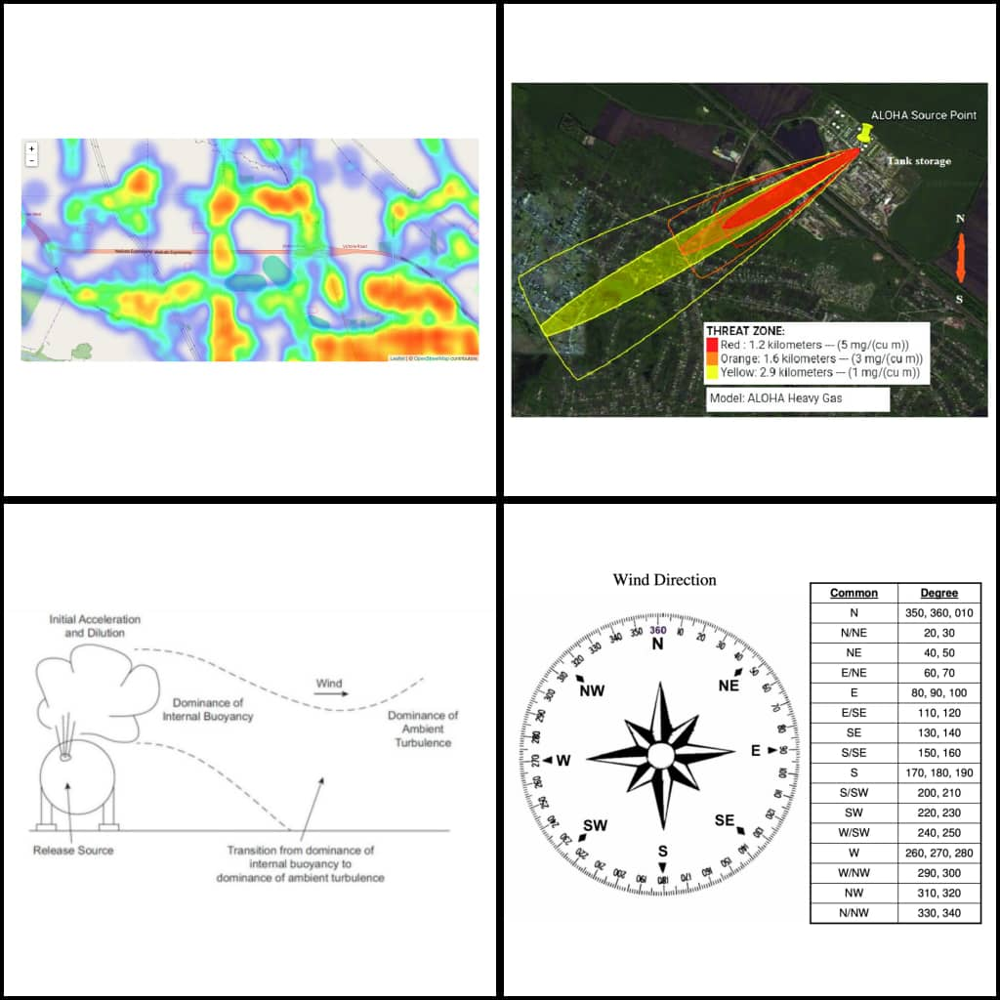

# 3D Toxic Gas Map Display 


<br>

## Introduction

<p>
This program is designed to display a 3D map of a dispersed toxic gas using ReactJS, Python, and NodeJS. The program takes in data collected from air quality sensors and uses advanced visualization techniques to provide an accurate and detailed view of the gas dispersion pattern.

This repository provides an implementation of the Pasquill-Gifford dispersion model for analyzing the dispersion of toxic gases in the atmosphere. The Pasquill-Gifford model is widely used to estimate the downwind concentration of pollutants emitted from point sources. It takes into account various meteorological factors to predict the dispersion pattern and concentration levels of the released gas.
</p>


## Prerequisites 

<p> 
To run the dispersion model, ensure that you have the following dependencies installed: 
<ul>
<li> Python (version 3.6 or higher) </li> 
<li> Numpy(version 1.0 or higher) </li> 
</ul>
</p>

## Usage 
* Clone the repository: 

```bash 
    $ git clone https://github.com/your-username/3d-dispersion-model.git
```

* Navigate to the project directory: 
```bash
    $ cd "3d-toxic-gas-dispersion" 
```

## Important Concepts 

## Wind Coordinates 

<p> 
The wind coordinates refer to a system for representing the velocity and direction of wind in a two-dimensional space. It allows us to understand the wind's movement in terms of its speed and the direction it is blowing towards. The wind coordinates are typically expressed as eastward (u) and northward (v) components of the wind velocity vector.
</p> 

### Calculation 

<p> 
To calculate the wind coordinates, we use the concept of wind direction and wind speed. The wind direction represents the direction towards which the wind is blowing, usually measured in degrees clockwise from true north. The wind speed represents the magnitude or intensity of the wind.

<br> 

Using the wind direction, we can determine the x (eastward) and y (northward) components of the wind velocity vector. These components are calculated by decomposing the wind speed into its eastward and northward parts, based on the wind direction.
</p> 

### Usage 

<p> 
Wind coordinates are commonly used in various fields such as meteorology, environmental science, aviation, and maritime industries. They provide crucial information for understanding and predicting weather patterns, analyzing wind patterns, and assisting in navigation and flight planning.

<br> 

When working with wind data, it is important to consider the wind coordinates to accurately interpret and utilize wind information in different applications.
</p> 

## Wind Direction 

<p> 
The wind direction refers to the direction towards which the wind is blowing. It is an essential parameter used to describe and analyze the movement of wind. The wind direction is typically measured in degrees clockwise from true north.
</p>

### Determining Wind Direction 

<p> 
There are various methods for determining wind direction. The most common approach is to use a wind vane or an anemometer equipped with a wind vane. The wind vane is designed to align itself with the wind, indicating the wind's direction. The degrees on the wind vane or anemometer represent the wind direction, where 0 degrees represents north, 90 degrees represents east, 180 degrees represents south, and 270 degrees represents west.
</p>

### Significance 

<p>
Wind direction is a fundamental parameter in meteorology, climate studies, renewable energy assessments, and numerous outdoor activities. It provides critical information for understanding weather patterns, analyzing airflow patterns, and predicting wind behavior. Wind direction is often used in conjunction with wind speed to obtain a comprehensive understanding of wind characteristics.

When analyzing wind data or planning activities dependent on wind conditions, considering the wind direction helps make informed decisions and ensures safety and efficiency.
</p>

## Installation 

<p> 
To use this program, follow these steps:
<ol>
<li> Clone the repository onto your local machine. </li>
<li> Install the required dependencies using the package managers for ReactJS, Python, and NodeJS. </li> 
<li> Start the server using NodeJS. </li>
<li> Start the ReactJS client using npm. </li>
<li> Input the data file containing the sensor readings for the toxic gas. </li>
<li> Select the visualization settings that you prefer, such as the color scheme, gas concentration range, and 3D view angle. </li>
<li> Click the "Display" button to generate the 3D gas map. </li>

</ol>
</p>

## Usage 

<p> 
The program is designed to be user-friendly and easy to use. Once you have installed the program and its dependencies, follow these steps to display the 3D gas map:

<ol>
<li> Start the NodeJS server using the command line. </li> 
<li> Start the ReactJS client using npm. </li> 
<li> Input the data file containing the sensor readings for the toxic gas. </li> 
<li> Select the visualization settings that you prefer, such as the color scheme, gas concentration range, and 3D view angle. </li> 
<li> Click the "Display" button to generate the 3D gas map. </li> 
</ol>

The 3D gas map can be manipulated using the mouse or touch screen, allowing you to zoom in and out, rotate the view, and adjust the perspective to suit your needs.
</p>

## Credits

<p> 
This program was developed by [Your Name] as part of [Project Name]. The program uses open-source libraries and frameworks, including [List of libraries and frameworks used], and was inspired by [Source of inspiration]. We would like to thank the developers of these resources for their contributions to the scientific and programming communities. </p>

## License

<p> 
This program is licensed under the [Insert License Here] license. You are free to use, modify, and distribute the program as long as you comply with the terms of the license. Please see the LICENSE file for more information. </p> 